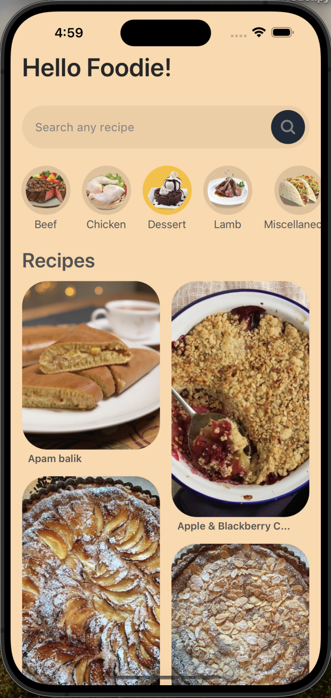

# Food-Recipe-App
1. This is a responsive Food Recipe App.
2. The UI designing is done using Microsoft Axure.
3. Tools used: React Native(Async Storage, Reanimated), Tailwind CSS

# To run
npm start

  
   

